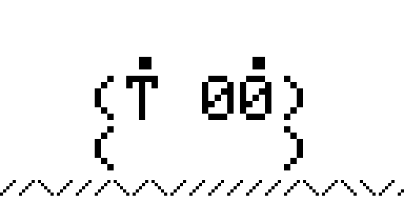

# PORKCHOP - Flipper Zero Asset Pack

A Flipper Zero animation pack featuring the pig companion from [M5PORKCHOP](https://github.com/0ct0sec/M5PORKCHOP), rendered with the original Adafruit GFX bitmap font.

## Preview

| Idle | Happy | Hunting |
|------|-------|---------|
|  |  |  |

| Sleepy | Angry | Sad |
|--------|-------|-----|
|  |  |  |

## Animations

| Animation | Description | Frames | FPS |
|-----------|-------------|--------|-----|
| Porkchop_Idle | Neutral face with clouds, blink, left/right | 10 | 4 |
| Porkchop_Happy | Happy face with excited bursts, "OINK!" | 10 | 5 |
| Porkchop_Hunting | Focused eyes with sniff sequence, clouds | 11 | 5 |
| Porkchop_Sleepy | Drowsy face with "Zzz..." | 8 | 3 |
| Porkchop_Angry | Angry shaking with "GRRR!" | 8 | 6 |
| Porkchop_Sad | Sad face, slow animation | 8 | 3 |

## Icons

- **Passport** - Happy, okay, and bad mood faces (46x49)
- **Dolphin** - Event images for DolphinMafia and DolphinSaved

## Install

Copy the `PORKCHOP` folder from `source/` to your Flipper's SD card:

```
SD Card/asset_packs/PORKCHOP/
```

Or use the pre-built archives in `download/`.

## Character

The pig face is a 3-line ASCII art character with 7 emotional states, each in left-facing and right-facing variants:

```
 ?  ?       ^  ^       |  |       \  /
(o 00)     (^ 00)     (= 00)     (# 00)
(    )     (    )     (    )     (    )
neutral    happy      hunting    angry
```

Based on the avatar system in [M5PORKCHOP's piglet module](https://github.com/0ct0sec/M5PORKCHOP/tree/800f06b070f016bcf8e0a0ee2c76b7c247e72215/src/piglet).

## Regenerate

Requires Python 3 with Pillow and heatshrink2:

```bash
pip install Pillow heatshrink2
python3 generate_pack.py
```

This generates both compiled `.bm`/`.bmx` files (in `source/`) and editable PNGs (in `png/`).

## Credits

- Original character: [0ct0sec](https://github.com/0ct0sec)
- Asset pack: [pfefferle](https://github.com/pfefferle)
